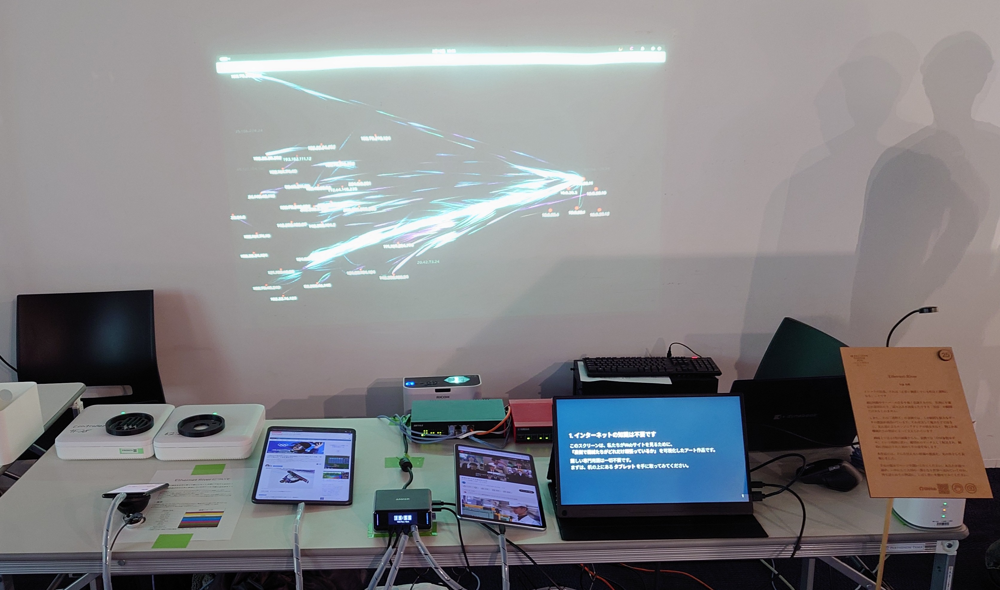

# Hi, I'm Noah (27卒 / CS Student)👋

  

  

    <b>Network / Infrastructure / Backend</b> 
    「システムが、なぜ、どうやって動いているのか」を深堀りするのが好きです。プログラミングの快感も、ネットワークのパズルも、サーバーの構築も、全部繋がっているから面白い。 
    「器用貧乏」と思うこともありますが、レイヤーを跨いで問題を解決できるエンジニアを目指しています
  

  
  

---

## 🛡️ My Values

自分が苦労して書いたコードが、しっかり動いてくれる瞬間の快感が原点です。

- **深堀りを大切にしたい**

  トラブルに直面したとき、「設定ミスかな」という推測で済ませたくありません。
  `ping` や `traceroute` を叩き、Wiresharkを広げてパケットの挙動を追う。どこまでが正常で、どこからが異常なのか。ブラックボックスを作らず、自分の目で「整合性」を確かめるプロセスを大切にしています。

- **「システム全体」を見渡す**

  コードだけでなくそれが動く環境、たとえばOSやネットワークの物理的な制約まで含めて「システム」として考え、気を配るべきだと信じています。

- **「壊れてもすぐ直せる」を設計する**

  「システムは作った瞬間からレガシー化が始まる」からこそ、変化に強い構造が必要です。Gitによる履歴管理や、電源を切れば確実に初期状態へリセットできる再現性の確保。ビジュアルアートのような「その時、その場所」限りの表現にこそ、止まらないための、あるいはすぐ直せるためのインフラの知恵が必要だと信じています。

- **「新しい技術」を課題解決の武器にする**

  単なる流行を追うのではなく、「このボトルネックを解消できるか？」「開発体験（DX）を向上できるか？」という視点で技術を検証します。新しい知見をプロダクトへ還元し、システムをより洗練された状態へアップデートしていくプロセスに喜びを感じます。

---

## 🚀 Featured Projects

### 1. [Ethernet-river](https://github.com/noah-devtech/eth-river-project)

インフラの宿命は「正常に機能している時ほど透明になる」こと。その透明な場所で動いている機械やエンジニアの営みを、直感的に伝えたいという想いで制作しました。
この作品ではユーザーが手元のデバイスで新しいページを開くと、その瞬間に目の前のスクリーンへ「光の粒」が反映されるという、物理空間と情報空間が直結したインタラクティブな体験を実現しています。

- **Purpose:** 目に見えないネットワーク通信の量と流れを、直感的に理解可能な形で物理空間に投影すること。
- **Architecture:**
  - **Capture:** `pyshark` を用い、パケットをリアルタイム解析。
  - **Communication:** 解析データをOpenSound Control (OSC) プロトコルで描画用ソフトウェアへ転送。
  - **Visualization:** Java (Processing) 側で受信データに基づきパーティクルを生成・描画。
- **Tech:** Python, Java (Processing), OSC
- **Network Hardware:** FWX120, Cisco AIR-AP1832I-Q-K9, BUFFALO BS-GS2008P

### 💡 Attention to Detail

最初はラズパイ4BでL2ブリッジを組みパケットキャプチャを行っていましたが、高負荷時のボトルネックやスループットに限界を感じ、FWX120やCisco Aironetといった業務用NW機器を導入してアーキテクチャを刷新しました。
またconfigファイルも含めてGit管理することで、異常発生時の迅速なロールバックや、イベント当日の安定稼働を実現しました。
「イベント当日に絶対に落とさない」ための、自分なりのSRE（Site Reliability Engineering）への挑戦です。

### 2. [Processing 4 Build Automation System](https://github.com/noah-devtech/Processing4-Gradle-Template)
>
> **Solving native library dependency hell & Java 17 module restrictions.**

Processing 4をIntelliJ等のモダンIDEで開発するためのGradleテンプレートです。

- **Problem:** OSごとのネイティブライブラリ（JOGL/OpenGL）の手動管理が困難であり、Java 17のモジュールシステムによる制約により起動しない問題がありました。
- **Solution:** `build.gradle.kts`によるプラットフォームの動的判定と、JVM引数（`--add-opens`）の自動注入を実装し、 **誰でも・どのOSでも一発で動く** 環境を実現しました。
- **Tech:** Java 17, Gradle (Kotlin DSL), GitHub Actions

---

## 🛠️ Tech Stack

  **Main Languages** 
  
  
    

  **Infrastructure & OS (Home Lab)** 
  
  
  
  
   
  
  
    

  **Tools & Automation** 
  
  
  
   
  
  
   

---

## 🖥️ Home Lab Environment

### Main Server

- CPU: Intel Xeon E5-2650 v4 (12Core / 24Thread)
- Motherboard: ASRock X99 Taichi
- RAM: 128GB DDR4 ECC Registered
  - Insight: 多数のコンテナー・VM稼働を支える潤沢なリソースを確保。ビット反転によるデータ破損やシステム停止を防ぐため、中古パーツの選定段階からECCメモリを採用しました。
- OS: Proxmox VE

### Self-hosted Services (LXC / VM / Docker)

便利なツールを「探して、試して、自分のものにする」プロセスを楽しみながら、生活を支える各種サービスをセルフホストしています。

- AdGuard Home
  ネットワーク全体のDNSクエリを統制。DNSレイヤーでの広告ブロックとプライバシー保護。

- Tailscale
  外部から自宅のラボへ安全にアクセスするためのメッシュVPN。

- TrueNAS (Planning)
  ZFSベースのストレージサーバー。データの冗長化とスナップショット機能を活用し、重要なファイルやプロジェクトの安全を確保。

---

## 📫 How to reach me

2027年卒のソフトウェアエンジニア志望です。OSやネットワーク、インフラ技術に強い関心があります。

- ✉️ [Email Me](mailto:noah.dev.tech@gmail.com)
