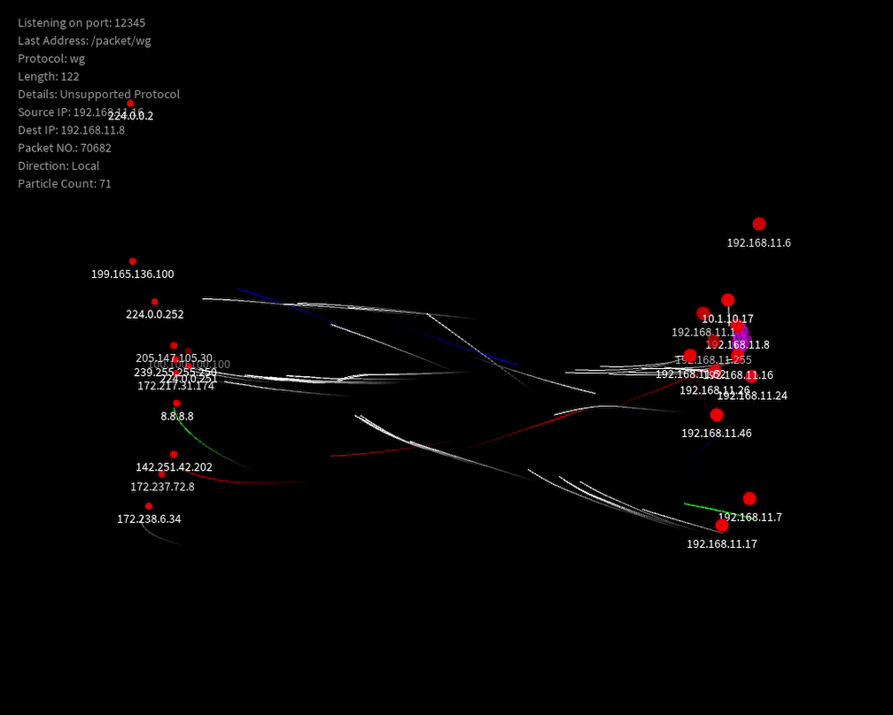

# Hi, I'm Noah (27卒 / CS Student)👋

  

  

    <b>Network / Infrastructure / Backend</b> 
    自宅サーバー（Home Lab）とネットワークインフラ、開発環境の自動化やコード化(IaC)に関心があります。 
    低レイヤーの理解を武器に、堅牢なバックエンドシステムを構築することが目標。 
    単に動くコードではなく、技術的な制約やシステムアーキテクチャ、保守性を考慮した「設計されたコード」の実装を心がけています。
  

  
  

---

## 🛠️ Tech Stack

  
  **Main Languages** 
  
  
    

  **Infrastructure & OS (Home Lab)** 
  
  
  
  
   
  
  
    

  **Tools & Automation** 
  
  
  
   
  
  
   

---

## 🚀 Featured Projects

### 1. Ethernet-river
>
> **Visualizing network traffic flow using OSC protocol.**

ネットワークパケットの流れを「光の川」としてリアルタイムに可視化するインタラクティブ・インスタレーションです。

* **Purpose:** 目に見えないネットワーク通信の量と流れを、直感的に理解可能な形で物理空間に投影すること。
* **Architecture:**
  * **Capture:** Raspberry Pi上で `Pyshark` を用い、パケットをリアルタイム解析。
  * **Communication:** 解析データをOpenSound Control (OSC) プロトコルで描画用PCへ低遅延転送。
  * **Visualization:** Java (Processing) 側で受信データに基づきパーティクルを生成・描画。
* **Tech:** Python, Java (Processing), OSC, Raspberry Pi

### 2. [Processing 4 Build Automation System](https://github.com/noah-devtech/Processing4-Gradle-Template)
>
> **Solving native library dependency hell & Java 17 module restrictions.**

Processing 4をIntelliJ等のモダンIDEで開発するためのGradleテンプレートです。

* **Problem:** OSごとのネイティブライブラリ（JOGL/OpenGL）の手動管理が困難であり、Java 17のモジュールシステムによる制約により起動しない問題がありました。
* **Solution:** `build.gradle.kts`によるプラットフォームの動的判定と、JVM引数（`--add-opens`）の自動注入を実装し、 **誰でも・どのOSでも一発で動く** 環境を実現しました。
* **Tech:** Java 17, Gradle (Kotlin DSL), GitHub Actions

---

## 📫 How to reach me

2027年卒のソフトウェアエンジニア志望です。低レイヤーやネットワーク、インフラ技術に強い関心があります。

* ✉️ [Email Me](mailto:noah.dev.tech+github@gmail.com)
